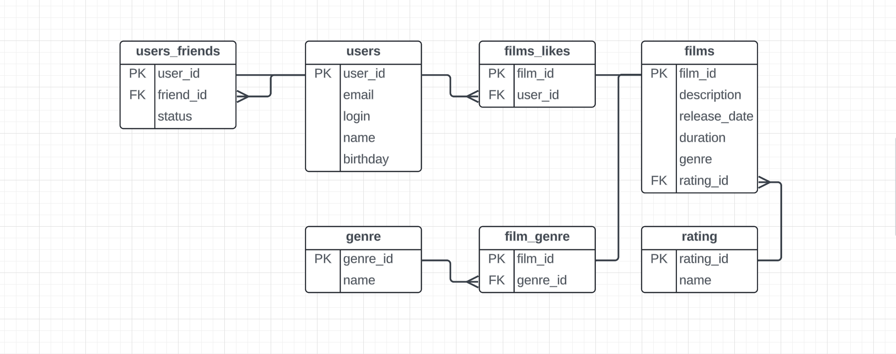

# java-filmorate
### Диаграмма базы данных


#### users
Содержит данные о пользователях. 
 
Таблица состоит из полей:
 * первичный ключ user_id — идентификатор пользователя;
 * email — электронная почта;
 * login — логин пользователя;
 * name — имя пользователя;
 * birthday — дата рождения пользователя;

#### users_friends
Промежуточная таблица. Содержит информацию о том, каких друзей (пользователей) содержат пользователи из таблицы users.

Таблица включает поля:

* user_id — идентификатор пользователя (первичный ключ);
* friend_id (отсылает к таблице movie) — идентификатор друга (внешний ключ);
* status — статус для связи «дружба» между двумя пользователями:
  * true - подтверждённая — когда второй пользователь согласился на добавление.
  * false - неподтверждённая — когда один пользователь отправил запрос на добавление другого пользователя в друзья.


#### films
Содержит данные о пользователях.

Таблица состоит из полей:
* первичный ключ film_id — идентификатор фильма;
* description — описание фильма;
* release_date — дата релиза;
* duration — продолжиткльность фильма в минутах;
* genre — жанр фильма, например:
  *  Комедия 
  * Драма 
  * Мультфильм 
  * Триллер 
  * Документальный 
  * Боевик
* rating — возрастной рейтинг, например:
  * G — у фильма нет возрастных ограничений,
  * PG — детям рекомендуется смотреть фильм с родителями,
  * PG-13 — детям до 13 лет просмотр не желателен,
  * R — лицам до 17 лет просматривать фильм можно только в присутствии взрослого,
  * NC-17 — лицам до 18 лет просмотр запрещён.

#### rating
Содержит данные о рейтингах (возрастных ограничениях фильма).

Таблица состоит из полей:
* rating_id - идентификатор рейтинга (первичный ключ);
* name - наименование рейтинга;
  * G — у фильма нет возрастных ограничений,
  * PG — детям рекомендуется смотреть фильм с родителями,
  * PG-13 — детям до 13 лет просмотр не желателен,
  * R — лицам до 17 лет просматривать фильм можно только в присутствии взрослого,
  * NC-17 — лицам до 18 лет просмотр запрещён.

#### genre
Содержит данные о жанрах фильма.

Таблица состоит из полей:
* genre_id - идентификатор жанра (первичный ключ);
* name - наименование жанра;
  * Комедия
  * Драма
  * Мультфильм
  * Триллер
  * Документальный
  * Боевик

#### film_genre
Промежуточная таблица. Содержит информацию о том какие жанры имеют фильмы.

Таблица включает поля:

* film_id — идентификатор фильма (первичный ключ);
* genre_id - идентификатор жанра;

#### films_likes
Промежуточная таблица. Содержит информацию о том, каким пользователям понравились фильмы из таблицы films.

Таблица включает поля:

* film_id (отсылает к таблице film) — идентификатор фильма (первичный ключ);
* user_id — идентификатор пользователя (внешний ключ);

#### Связи между таблицами
1) Таблица **users_friends** связана первичным ключом (**user_id**) с таблицей users и внешним ключом (**friend_id**) с 
таблицей users. У одного пользователя (**user_id**) может быть много друзей (**friend_id**). Так как друг 
(**friend_id**) также, по сути, является пользователем, он может быть другом у нескольких пользователей (**user_id**). 
Связь многие ко многим.

2) Таблица **films_likes** связана первичным ключом (**film_id**) с таблицей films и внешним ключом (**user_id**) с
таблицей users. Одному пользователю (**user_id**) может понравится несколько фильмов (**film_id**). Также и один фильм 
(**film_id**) может понравиться нескольким пользователям (**user_id**).
Связь многие ко многим.

3) Таблица **films_genre** связана первичным ключом (**film_id**) с таблицей films и внешним ключом (**genre_id**) с
   таблицей genre. Один и тот же жанр (**genre_id**) может быть у нескольких фильмов (**film_id**). Также и один фильм
   (**film_id**) может иметь несколько жанров (**genre_id**).
   Связь многие ко многим.

4) Таблица **rating** связана первичным ключом (**rating_id**) c таблицей films. Один рейтинг может принадлежать 
нескольким фильмам, но у фильма может быть только 1 рейтинг. Связь один ко многим.

#### Примеры запросов для основных операций
Получение всех фильмов:
```
SELECT *
FROM films;
```
Получение всех пользователей:

```
SELECT *
FROM users;
```

Tоп n наиболее популярных фильмов:
```
SELECT fl.film_id,
       COUNT(fl.user_id) AS likes_count
FROM films_likes AS fl
GROUP BY fl.film_id
ORDER BY
LIMIT n;
```
Получение списка общих друзей (с id=x) с другим пользователем (с id=y):
```
SELECT *
FROM users
WHERE user_id IN (SELECT friend_id
                  FROM users_friends AS fr1
                  JOIN users_friends AS fr2 ON fr1.friend_id = fr2.friend_id
                  WHERE fr1.user_id = x
                  AND FR2.user_id = y
                  AND fr1.status = true
                  AND fr2.status = true);
```